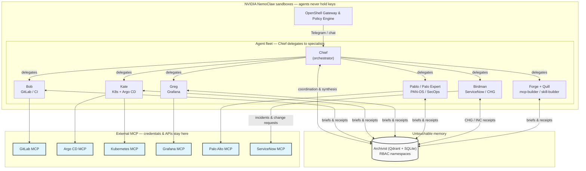

# MemoryOps: The Autonomous GitOps Fleet
**Security-first by design. Shared memory with RBAC. MCP as the integration boundary.**

 

*Security-first architecture for a multi-agent GitOps fleet — scale without treating API keys as chat fuel.*

**Public repo:** [github.com/NetworkBuild3r/nemoclaw](https://github.com/NetworkBuild3r/nemoclaw) · Platform: [NVIDIA NemoClaw](https://github.com/NVIDIA/NemoClaw)

---

## 🚀 Security first, then capability

A single “do everything” agent with a backpack full of API keys fails security review before it ships. **MemoryOps** inverts that: we designed **trust boundaries**, **least privilege**, and **where secrets may live** first—then layered **Git**, **Argo CD**, **Kubernetes operations**, **observability**, and two specialist lanes that enterprises actually audit: **ITSM / change control** (**Birdman**, `snow-birdman`) and **firewall / SecOps** (**Palo Expert**, `palo-expert` — team codename **Pablo**) on top of **NemoClaw** + **OpenClaw**.

| Design decision | Security outcome |
|-----------------|------------------|
| **Chief + specialist fleet** | One human entry point; **delegation** keeps blast radius small—GitOps and SecOps tools run in the right **agent identity**, not everywhere. |
| **MCP-only integrations** | External systems are **named tools**, not arbitrary HTTP from the model. Credentials stay on **MCP servers** behind a **cluster aggregator**, not in prompts. |
| **Archivist + RBAC namespaces** | Shared **long-term memory** with **partitioned read/write**—not one flat blob any session can overwrite. |
| **HashiCorp Vault** | **Source of truth** for secrets that sync into **trusted runtime** (gateway, workloads). See [`docs/vault-project-env.md`](docs/vault-project-env.md) and [`docs/vault-telegram-bots.md`](docs/vault-telegram-bots.md). |
| **Policies + sandbox egress** | NemoClaw / OpenShell **allow-lists** align network reality with what `mcporter` may call (e.g. aggregator + Archivist). |

**Demo-friendly outcomes:** **GitOps** through Git + **Argo CD**; **Birdman** files **incidents** and **change requests** in **ServiceNow** so releases have an ITSM trail; **Pablo / Palo Expert** pulls **live PAN-OS** state through the **Palo Alto MCP** for audits and troubleshooting—**no tokens in chat**, only tool calls and receipts in Archivist.

Narrative for slide / judges: [`docs/GITHUB-SUBMISSION.md`](docs/GITHUB-SUBMISSION.md).

> *We did not “add security later.” We picked a shape where the **safe path is the default path**.*

### Operating philosophy (Tesla / SpaceX style)

Every agent follows the same **five-step** discipline in [`agents/ENGINEERING_ALGORITHM.md`](agents/ENGINEERING_ALGORITHM.md): **make requirements less dumb** → **delete waste** → **optimize** → **accelerate the right process** → **automate last**. First principles over cargo cult; **the best part is no part** when it adds no value; never automate broken work.

### Fleet at a glance

**Who does what** (GitOps vs SecOps vs ITSM vs builders, **Chief** vs **ahead-chief**, workspace → `agentId` → Archivist) lives in **[`docs/FLEET-ROSTER.md`](docs/FLEET-ROSTER.md)** — start there when splitting work or registering agents in `openclaw.json`.

| Squad | Agents | Notes |
|-------|--------|--------|
| **Delivery** | Bob (`gitbob`), Kate (`kubekate`), Greg (`grafgreg`) | Kate uses **`kubernetes`** + **`argocd`** MCPs (no separate `argo` agent). |
| **ITSM / change** | **Birdman** (`snow-birdman`) | **`servicenow`** MCP — incidents + **CHG** / CAB-friendly change records. Archivist namespace **`change-control`**. Chief delegates SNOW execution here. |
| **SecOps / firewall** | **Palo Expert** (`palo-expert`, codename **Pablo**) | **`paloalto`** MCP — PAN-OS reads, audits, troubleshooting. Archivist **`firewall-ops`**. Not Kubernetes; never route PAN-OS work to Kate. |
| **Factory** | Forge (`mcp-builder`), Quill (`skill-builder`) | **`skill-builder`** primary model **`openclaw-opus-46`**; research + repo skills merged here. |

### Birdman & Pablo in the story

**Birdman** is the **governance face** of the fleet: when GitOps or infra moves need a **change record**, CAB language, or incident thread, Chief hands off to **`snow-birdman`**. Same release narrative can mention both **Argo CD sync** and **CHG1234567**—Birdman owns the **ServiceNow** side so compliance and delivery stay linked.

**Pablo** (**Palo Expert**, `palo-expert`) is the **ground-truth face** for **network security**: rules, zones, NAT, and posture come from **PAN-OS via MCP**, not from guesswork in chat. Audits land in **`firewall-ops`** so SecOps receipts sit beside **`change-control`** receipts—**different MCPs, different namespaces**, one Chief thread.

Workspaces: [`agents/snow-birdman/`](agents/snow-birdman/) · [`agents/palo-expert/`](agents/palo-expert/)

---

## 🧠 Shared memory with RBAC (Archivist)

**Archivist-OSS** is the fleet’s **durable system of record** for coordination—not a chat transcript. Vector + graph storage (Qdrant + SQLite) backs **search**, **recall**, and **audit-style receipts**.

* **Explicit writes** — Specialists store outcomes (deployments, MRs, audits, CHG numbers) in the right **namespace** with the right **`agent_id`**.
* **Partitioned by role** — e.g. `pipeline` for CI/CD, `deployer` for cluster work, `change-control` for ServiceNow, `firewall-ops` for PAN-OS analysis—so memory stays **governed**, not a single shared scratchpad.
* **Chief synthesizes** — The orchestrator can read across namespaces for a unified answer **without** becoming the execution path for every MCP tool.

Details: [`archivist-oss/README.md`](archivist-oss/README.md), [`docs/ARCHIVIST.md`](docs/ARCHIVIST.md).

---

## 🛡️ Trust zones: gateway, agents, MCP, Vault

**Security property we optimize for:** integration **passwords and API keys are not part of agent-visible chat context**. Specialists call **tools**; **MCP servers** (and the cluster around them) own the **authenticated** conversation with GitLab, Kubernetes, Argo CD, Grafana, ServiceNow, and PAN-OS.

1. **Agents (sandboxes)** — NemoClaw / OpenShell **policies** and **egress allow-lists** match how we actually integrate: MCP endpoints and Archivist, not “any HTTPS.”
2. **OpenClaw gateway (trusted runtime)** — Loads **Telegram / channel** and **model provider** material from **Vault-backed files** on the host—**outside** the specialist’s workspace files. Agents are not asked to edit `vault.env`; they orchestrate **through** the gateway + tools.
3. **MCP aggregator (Kubernetes)** — Reference routing and manifests live under [`deploy/k8s/mcp-aggregator/README.md`](deploy/k8s/mcp-aggregator/README.md). One **ingress pattern** to many backends; **NetworkPolicy**-style separation is part of how we think about production (see diagram below).
4. **Vault → runtime** — Project and bot secrets flow via documented sync scripts (`scripts/vault-*.sh`); **never** commit real `mcporter.json` or LiteLLM keys—use [`config/mcporter.json.example`](config/mcporter.json.example) and [`stack/litellm-config.yaml.example`](stack/litellm-config.yaml.example).

**ServiceNow** — **Birdman** (`snow-birdman`) uses the **`servicenow`** MCP for incidents and **change requests**. **Palo Alto** — **Palo Expert** uses the **`paloalto`** MCP. **GitOps** — **Bob** / **Kate** / **Greg** use **GitLab**, **kubernetes**, **argocd**, **grafana** MCPs respectively. **Durable logic** (clients, validation, retries) lives in those servers—so the model spends tokens on **decisions**, not retyping `curl` one-liners.

**Honest edge case:** if a session is fully compromised, **prompt injection is still a risk class**—we reduce **credential exposure** and **blast radius**; we do not claim magic. Rotate in **Vault**; revoke in the IdP; MCP servers are the choke point.

---

## 👥 The Fleet: Segregation of Duties

Just like your engineering organization, we divide tasks into highly specialized, least-privilege personas:

### 👔 The Coordinator
* **Chief:** The orchestrator. Takes natural language requests, formulates a safe execution plan, and stores task briefs in Archivist. The Chief *never* executes cluster or Git commands directly—enforcing a strict blast radius.

### ⚙️ The Execution Fleet
* **Bob (GitBob):** The Git pipeline specialist — repositories, merge requests, and CI via the GitLab MCP (`gitbob`).
* **Kate (KubeKate):** **Kubernetes and Argo CD** — one specialist uses both the **`kubernetes`** and **`argocd`** MCPs for live cluster ops and GitOps sync/health/rollback (`kubekate`).
* **Birdman (`snow-birdman`):** The **ServiceNow / change-control** specialist. **Incidents**, **change requests**, CAB-friendly hygiene — so every serious GitOps move can cite an ITSM record. Chief coordinates; Birdman runs **`servicenow`** MCP tools and stores receipts in **`change-control`**.
* **Palo Expert (`palo-expert`, “Pablo”):** The **PAN-OS / firewall** specialist. Reads live firewall state through the **`paloalto`** MCP (rules, zones, NAT, posture), writes audits to **`firewall-ops`**. **Not** a Kubernetes agent — keeps network truth separate from cluster APIs.

### 🏗️ The Autonomous Builders (factory)
* **Forge (`mcp-builder`)** ships MCP server images and k8s deploys. **Quill (`skill-builder`)** researches, writes playbooks, and authors repo **`openclaw-skills/`** (primary model **`openclaw-opus-46`**). Two factory roles only — no separate research-only agent.

---

## 🏗️ Architecture Flow

**Editable diagram (judges / slide):** [`docs/diagrams/nemoclaw-fleet-architecture.drawio`](docs/diagrams/nemoclaw-fleet-architecture.drawio) — Vault, gateway, agent fleet, Archivist, Kubernetes + Argo CD + MCP aggregator + MCP backends. Open in [diagrams.net](https://app.diagrams.net).

Chief is the **single orchestrator**: the gateway routes the human to Chief, and **Chief delegates** every execution path to the right specialist (Bob, Kate, Greg, **Pablo / Palo Expert** for PAN-OS, **Birdman** for ServiceNow change control, factory builders). Specialists talk to **MCP servers** (keys live there) and persist **receipts** in Archivist.

---

## ✅ Challenge Checklist

Built for the **AHEAD × NVIDIA NemoClaw Challenge** — **security architecture** and **enterprise workflow** in the same repo:

- [x] **Security-first posture:** Sandboxed agents, **MCP-only** integration edge, **Vault**-backed secrets, **K8s MCP aggregator** pattern (see [`deploy/k8s/mcp-aggregator/README.md`](deploy/k8s/mcp-aggregator/README.md)).
- [x] **NemoClaw-powered:** OpenShell policies + NVIDIA NIM / LiteLLM routing (`nvidia/nemotron-3-super-120b-a12b` and documented alternates).
- [x] **Enterprise use case:** **GitOps** (Git + **Argo CD**), **ITSM / change** (**Birdman** / **`servicenow`** MCP), **SecOps** (**Pablo** / **Palo Expert** / **`paloalto`** MCP), **observability** (Grafana MCP)—each with **least-privilege** specialist agents.
- [x] **Archivist:** Fleet-wide memory with **RBAC namespaces**—not a single unpartitioned knowledge dump.

---

## 🚀 Technical Deep Dive

Looking for the dense technical instructions on how to start the repository, configure Docker, or setup Vault? 

👉 **[See the Setup & Repository Guide (`docs/SETUP.md`)](docs/SETUP.md)**

---

  <i>Engineered for the AHEAD × NVIDIA NemoClaw Challenge</i>

