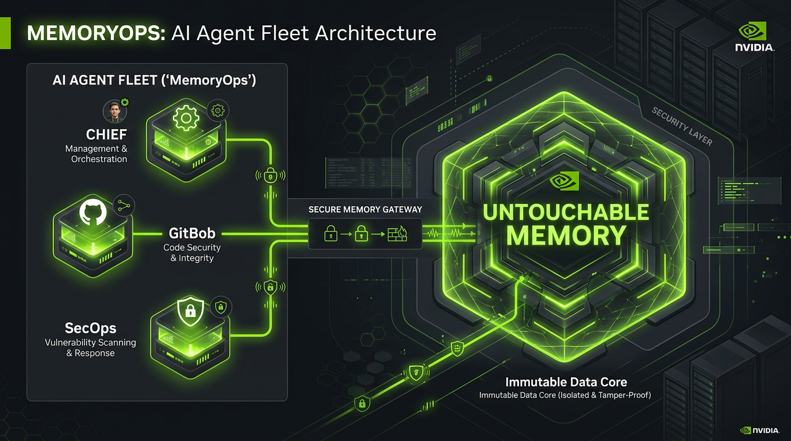
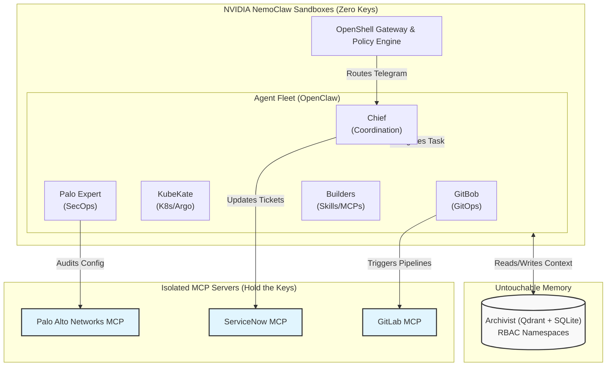

# MemoryOps: The Autonomous GitOps Fleet
**Secure by Design. Powered by Untouchable Memory.**

 

*Built for enterprise leaders who demand autonomous scale without compromising security.*

---

## 🚀 The Executive Summary

Enterprise IT is at a breaking point. Deploying a single, "God-mode" AI agent to manage operations is a security nightmare: it requires sprawling API access, loses critical context the moment it crashes, and presents a massive risk for credential exfiltration.

**MemoryOps** is a paradigm shift. Built on the **NVIDIA NemoClaw** platform, it introduces a fully autonomous, logically segmented GitOps fleet. We guarantee:
1. **Zero-Leakage Architecture:** Agents are sandboxed and never hold API keys.
2. **Untouchable Long-Term Memory:** Corporate knowledge is permanently retained across sessions, crashes, and team handoffs.
3. **Reduced MTTR (Mean Time To Resolution):** Specialized AI agents collaborate seamlessly across GitLab, Kubernetes, ServiceNow, and Palo Alto Networks.

> *"We aren't just automating terminal commands; we are building a secure, resilient AI workforce that retains institutional knowledge forever."*

---

## 🧠 The Differentiator: Untouchable Multi-Team Memory

The defining feature of our GitOps fleet is **Archivist**—a persistent, vector-backed (Qdrant + SQLite) memory system. 

When legacy AI agents communicate, context dies with the session. In our architecture:
* **Persistent Receipts:** Agents explicitly store deployment logs, security audits, and infrastructure state directly into Archivist.
* **RBAC Namespaces:** Memory is strictly partitioned. The `pipeline` namespace holds CI/CD data, `deployer` holds cluster state, and `secops` holds firewall audits.
* **Cross-Team Synthesis:** The *Chief* orchestrator can query across all namespaces to instantly synthesize a complete picture of the enterprise—without ever interrupting the specialist execution agents. 

Nobody can "touch" or accidentally erase this corporate memory. It survives agent restarts, session drops, and complete system rebuilds.

---

## 🛡️ Zero-Leakage Architecture: NemoClaw + MCP

Security is not an afterthought; it is the foundation. We guarantee that **no agent ever holds an API key or secret token.**

1. **NemoClaw Sandboxing:** Every agent runs inside a strict, policy-controlled OpenShell sandbox. Egress is explicitly whitelisted. An agent cannot simply `curl` an external server to exfiltrate data.
2. **MCP as the Security Boundary:** We use the **Model Context Protocol (MCP)** to mathematically isolate sensitive operations:
    * Agents do not hold ServiceNow API keys; they talk to the ServiceNow MCP server.
    * Agents do not hold Palo Alto firewall credentials; they query the Palo Alto MCP server.
    * **The CTO Guarantee:** Even if an agent goes rogue or suffers a prompt injection attack, **there are no keys to leak.** 

---

## 👥 The Fleet: Segregation of Duties

Just like your engineering organization, we divide tasks into highly specialized, least-privilege personas:

### 👔 The Coordinator
* **Chief:** The orchestrator. Takes natural language requests, formulates a safe execution plan, and stores task briefs in Archivist. The Chief *never* executes cluster or Git commands directly—enforcing a strict blast radius.

### ⚙️ The Execution Fleet
* **GitBob:** The GitOps Specialist. Manages repositories, opens Merge Requests, and triggers CI pipelines via the GitLab MCP.
* **KubeKate & Argo:** The Deployment Specialists. KubeKate interacts with the Kubernetes MCP for raw cluster management, while Argo handles continuous deployment syncs.
* **Palo Expert:** The SecOps Auditor. Validates firewall configurations via the Palo Alto MCP, ensuring every deployment complies with enterprise security baselines.

### 🏗️ The Autonomous Builders
* **Skill-Builder & MCP-Builder:** A fleet that writes its own tools. Dedicated agents tasked solely with writing new OpenClaw skills or building new Python MCP servers, ensuring the core team remains focused on production.

---

## 🏗️ Architecture Flow

---

## ✅ Challenge Checklist

Built for the **AHEAD × NVIDIA NemoClaw Challenge**, hitting all key requirements:

- [x] **NemoClaw-Powered:** Runs on NVIDIA NemoClaw. Agents execute within OpenShell sandboxes using local LiteLLM and NVIDIA NIM (`nvidia/nemotron-3-super-120b-a12b`).
- [x] **Enterprise Use Case:** Dedicated to **DevOps & SecOps**. Tackles complex workflows—task delegation, infrastructure-as-code, and firewall auditing—proving AI can scale enterprise operations safely.
- [x] **Integrate the Ecosystem & Bonus Points:** 
  - **Palo Alto Networks:** Custom MCP server to read PAN-OS firewalls, enabling SecOps audits without agent credential leakage.
  - **ServiceNow:** Custom MCP server for ITSM ticketing and tracking.
  - **Archivist:** Shared, persistent vector-memory bridging the entire fleet.

---

## 🚀 Technical Deep Dive

Looking for the dense technical instructions on how to start the repository, configure Docker, or setup Vault? 

👉 **[See the Setup & Repository Guide (`docs/SETUP.md`)](docs/SETUP.md)**

---

  <i>Engineered for the AHEAD × NVIDIA NemoClaw Challenge</i>

