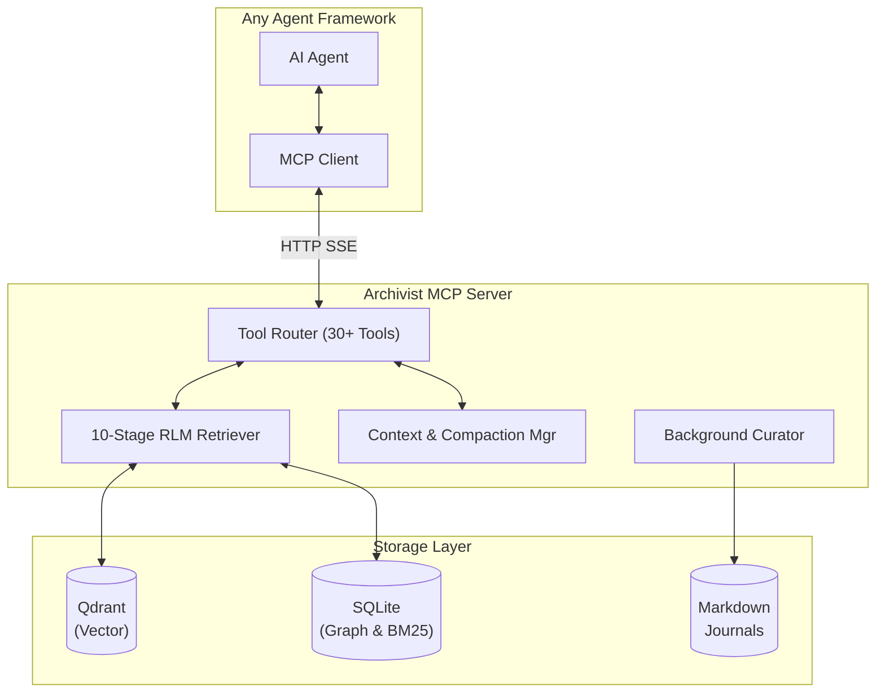

<p align="center">
  
</p>

# Archivist: Stop Letting Your AI Agents Forget.

**The first true Memory-as-a-Service for multi-agent fleets.** Combining Vector Search, Temporal Knowledge Graphs, and Active Context Management into a single MCP-native service.

---

> **In this repository (NemoClaw challenge demo):** Archivist is the **shared fleet memory** stack used with OpenClaw agents on ROC. Start from the [repo root `README.md`](../README.md) for the full layout, or [`docs/ARCHIVIST.md`](../docs/ARCHIVIST.md) for how this folder plugs into LiteLLM, Qdrant, and the GitOps agents.  
> **Upstream lineage:** [`github.com/NetworkBuild3r/archivist-oss`](https://github.com/NetworkBuild3r/archivist-oss) — this copy includes **demo-specific patches** under version control in the parent repo.

## The Problem

AI agents are amnesiacs. If you rely purely on vector databases, you get noisy retrievals, blown context windows, and agents that step on each other's toes. Archivist solves this by actively curating memory, compacting conversations, and enforcing multi-agent access controls.

<p align="center">
  
</p>

Dev teams building AI fleets hit three walls:

1. **Context Collapse:** Standard RAG just throws `top-k` chunks at the LLM. Eventually, your token limit blows up, and the agent loses the plot.
2. **Multi-Agent Chaos:** When multiple agents work together, they overwrite or hallucinate over each other's memories. Standard DBs lack access control.
3. **Passive Storage:** Databases wait to be queried. They don't actively curate facts, deduce contradictions, or summarize old conversations in the background.

## How We Solve It

- **Active Context Window Management (New!)**: Archivist actively tracks token budgets, splits messages, and hints to agents when it's time to compress context.
- **Conversation Compaction (New!)**: We don't just delete old logs; a background ReAct agent structures past interactions into `Goals`, `Progress`, `Decisions`, and `Next Steps`.
- **Hybrid Search Engine (New!)**: Fusing Qdrant (Vector) with SQLite FTS5 (BM25 Keyword) for unparalleled retrieval accuracy.
- **10-Stage RLM Retrieval Pipeline**: Coarse recall → Deduplication → Graph Augmentation → Temporal Decay → Cross-Encoder Rerank → LLM Synthesis.
- **Human-Readable "Memory as Files"**: Memories aren't trapped in opaque blobs. They are exported as daily, human-readable markdown journals.

## Why We Are Better

- **Built for Fleets (RBAC):** We have namespace-based Access Control. Agent A can read Agent B's memory, but can't write to it. Competitors don't have this.
- **Language Agnostic (MCP):** Exposes 30+ tools via the Model Context Protocol (MCP). Use it with Python, TS, Go, or any framework (OpenClaw, etc.).
- **Temporal Knowledge Graph:** We use SQLite to map Entity-Relationship-Fact triples, so agents understand *when* and *how* facts relate, not just that their vectors are similar.

## Everything a Dev Team Needs to Know

- **Drop-in Docker Compose**: `docker compose up -d` gives you Archivist + Qdrant + SQLite.
- **Bring Your Own Models**: Compatible with any OpenAI-compliant API (LiteLLM, Ollama, vLLM).
- **Enterprise Observability**: Built-in Prometheus metrics, retrieval pipeline trace logs, and an admin health dashboard.

## Architecture Visualization



## Quick Start

### Prerequisites

- Docker & Docker Compose
- An OpenAI-compatible LLM API (OpenAI, LiteLLM, Ollama, vLLM, etc.)
- An OpenAI-compatible embeddings API

### 1. Clone and configure

```bash
git clone https://github.com/NetworkBuild3r/archivist-oss.git
cd archivist
cp .env.example .env
# Edit .env with your LLM/embedding API details
```

### 2. Start services

```bash
docker compose up -d
```

This starts:
- **Archivist** on port `3100`
- **Qdrant** on port `6333`

### 3. Verify

```bash
curl http://localhost:3100/health
# {"status": "ok", "service": "archivist", "version": "1.0.0"}
```

### 4. Connect an MCP client

Point your MCP client at: `http://localhost:3100/mcp/sse`

## MCP Tools (30 total)

### Search & Retrieval

| Tool | Description |
|------|-------------|
| `archivist_search` | Semantic search with 10-stage RLM pipeline. Supports fleet-wide, single-agent, or multi-agent queries with RBAC. Optional `min_score`, `tier`, `max_tokens`, date filters. |
| `archivist_recall` | Multi-hop knowledge graph lookup for entities and relationships |
| `archivist_timeline` | Chronological timeline of memories about a topic with configurable lookback |
| `archivist_insights` | Cross-agent knowledge discovery for a topic across accessible namespaces |
| `archivist_deref` | Dereference a memory by ID; returns full L2 text and metadata for drill-down |
| `archivist_index` | Compressed navigational index of knowledge in a namespace (~500 tokens) |
| `archivist_contradictions` | Detect contradicting facts about an entity across agents via the knowledge graph |

### Storage & Memory Management

| Tool | Description |
|------|-------------|
| `archivist_store` | Store a memory with entity extraction, conflict checks, and LLM-adjudicated dedup |
| `archivist_merge` | Merge conflicting memories using latest, concat, semantic, or manual strategies |
| `archivist_compress` | Archive memory blocks and return compact summaries (flat or structured format) |

### Trajectory & Feedback

| Tool | Description |
|------|-------------|
| `archivist_log_trajectory` | Log execution trajectory (task, actions, outcome) with auto-extracted tips |
| `archivist_annotate` | Add quality annotations (note, correction, stale, verified) to a memory |
| `archivist_rate` | Rate a memory as helpful (+1) or unhelpful (-1) |
| `archivist_tips` | Retrieve strategy/recovery/optimization tips from past trajectories |
| `archivist_session_end` | Summarize a session and optionally persist it as durable memory |

### Skill Registry

| Tool | Description |
|------|-------------|
| `archivist_register_skill` | Register or update a skill (MCP tool) with provider, endpoint, and version |
| `archivist_skill_event` | Log skill invocation outcomes (success, partial, failure) for health scoring |
| `archivist_skill_lesson` | Record failure modes, workarounds, and best practices for a skill |
| `archivist_skill_health` | Get health grade, success rate, recent failures, and substitutes for a skill |
| `archivist_skill_relate` | Record relations between skills (similar_to, depend_on, compose_with, replaced_by) |
| `archivist_skill_dependencies` | Get skill dependency/relation graph with configurable depth |

### Admin & Context Management

| Tool | Description |
|------|-------------|
| `archivist_context_check` | Pre-reasoning context check: token counting, budget usage, and compaction hints |
| `archivist_namespaces` | List memory namespaces accessible to the calling agent |
| `archivist_audit_trail` | View immutable audit log for memory operations |
| `archivist_resolve_uri` | Resolve an `archivist://` URI to its underlying memory, entity, namespace, or skill |
| `archivist_retrieval_logs` | Export retrieval pipeline execution traces for debugging and analytics |
| `archivist_health_dashboard` | Single-pane health view: memory counts, stale %, conflict rate, skill health, cache |
| `archivist_batch_heuristic` | Recommended batch size (1-10) from health signals (Batch Size Gravity) |

### Cache Management

| Tool | Description |
|------|-------------|
| `archivist_cache_stats` | Hot cache stats: entries per agent, TTL, hit rate |
| `archivist_cache_invalidate` | Manual cache eviction by namespace, agent, or all |

## Configuration

All configuration is via environment variables. See [`.env.example`](.env.example) for the full list.

### Key Settings

| Variable | Default | Description |
|----------|---------|-------------|
| `LLM_URL` | `http://localhost:4000` | OpenAI-compatible chat API |
| `LLM_MODEL` | `gpt-4o-mini` | Model for refinement/synthesis |
| `LLM_API_KEY` | *(empty)* | API key for LLM |
| `EMBED_URL` | `$LLM_URL` | OpenAI-compatible embeddings API |
| `EMBED_MODEL` | `text-embedding-v3` | Embedding model name |
| `VECTOR_DIM` | `1024` | Embedding vector dimension |
| `QDRANT_URL` | `http://localhost:6333` | Qdrant endpoint |
| `MEMORY_ROOT` | `/data/memories` | Directory to watch for .md files |
| `RETRIEVAL_THRESHOLD` | `0.65` | Minimum vector score for retrieval |
| `VECTOR_SEARCH_LIMIT` | `64` | Coarse vector hits to pull before threshold/rerank |
| `RERANK_ENABLED` | `false` | Enable cross-encoder reranking |
| `RERANK_MODEL` | `BAAI/bge-reranker-v2-m3` | Reranker model |
| `DEFAULT_CONTEXT_BUDGET` | `128000` | Default token budget for context management |
| `DEDUP_LLM_ENABLED` | `true` | Enable LLM-adjudicated dedup on store |
| `DEDUP_LLM_THRESHOLD` | `0.80` | Similarity threshold triggering LLM dedup |
| `ARCHIVIST_API_KEY` | *(empty)* | Optional Bearer/X-API-Key auth for all endpoints except `/health` |

### RBAC / Namespaces

Create a `namespaces.yaml` (see [`namespaces.yaml.example`](namespaces.yaml.example)) to define per-namespace read/write ACLs. Without it, Archivist runs in **permissive mode** (all agents can read/write everything) -- suitable for single-user setups.

### Agent Team Mapping

For multi-agent setups, create a `team_map.yaml` (see [`team_map.yaml.example`](team_map.yaml.example)) and set `TEAM_MAP_PATH` to its location. This maps agent IDs to teams for metadata tagging.

## API Endpoints

| Endpoint | Method | Description |
|----------|--------|-------------|
| `/health` | GET | Health check (unauthenticated for probes) |
| `/metrics` | GET | Prometheus metrics (text exposition) |
| `/mcp/sse` | GET | MCP SSE connection |
| `/mcp/messages/` | POST | MCP message handler |
| `/admin/invalidate` | GET/POST | Trigger TTL-based memory expiry |
| `/admin/retrieval-logs` | GET | Export retrieval pipeline logs and stats |
| `/admin/dashboard` | GET | Health dashboard (add `?batch=true` for batch heuristic) |

## Credits & inspiration

Archivist is **integration and execution** on top of a lot of public work: open-source
memory tooling, research papers, blog posts, and ideas from the agent community.
We are not claiming every pattern was invented here. For **who inspired what**
(ReMe, hybrid retrieval ideas, trajectory-memory papers, batch-heuristic framing,
and more), see **[`docs/INSPIRATION.md`](docs/INSPIRATION.md)**.

## Further Documentation

| Document | Description |
|----------|-------------|
| [`docs/ARCHITECTURE.md`](docs/ARCHITECTURE.md) | Module map, data flow, storage schema, per-version operational notes |
| [`docs/ROADMAP.md`](docs/ROADMAP.md) | Full version history and future plans |
| [`docs/INSPIRATION.md`](docs/INSPIRATION.md) | **Credits & lineage:** community and research influences, ReMe comparison, what we adopted vs. built ourselves |
| [`docs/REMOTES.md`](docs/REMOTES.md) | Multi-remote Git workflow for internal + public repos |
| [`CONTRIBUTING.md`](CONTRIBUTING.md) | Development conventions |

## License

Apache License 2.0 -- see [LICENSE](LICENSE).