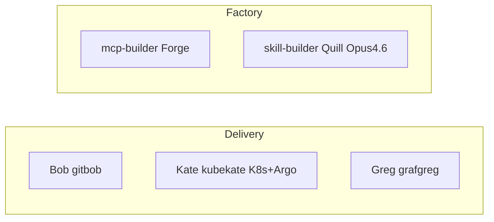
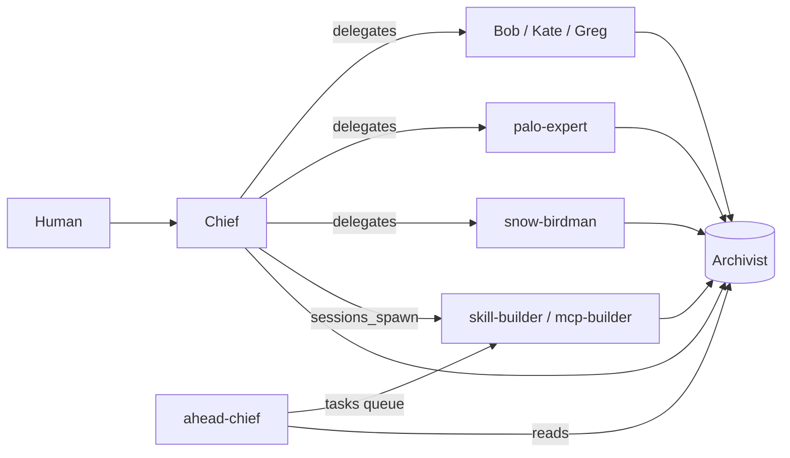

# Fleet roster — how the team breaks out

This document is the **single map** of who does what, which **MCP** they own, which **Archivist namespace** they write, and how **Chief** vs **ahead-chief** differ. Use it when onboarding agents, editing `openclaw.json`, or explaining the demo.

---

## Two front doors (do not confuse)

| Role | OpenClaw `agentId` | Workspace | Primary job |
|------|-------------------|-------------|-------------|
| **Chief of staff** | `chief` | `agents/chief/` | Human’s **Telegram entry point** — understands the ask, delegates execution, never runs specialist MCP tools. Writes **`chief`**. |
| **Task bus** | `ahead-chief` | `agents/ahead-chief/` | **Archivist-only** orchestrator for async builder work — writes **`tasks`**, reads fleet namespaces, **no Telegram chief bot**. For Palo / self-build demos when work is queued via memory, not chat. |

**Rule:** Brian talks to **`chief`**. **`ahead-chief`** coordinates **`tasks`** → builders; it does not replace the human relationship with Chief.

### Squads (how to remember the roster)

| Squad | Who | `agentId` | Role |
|-------|-----|-----------|------|
| **Delivery** | Bob | `gitbob` | GitLab / pipeline |
| | Kate | `kubekate` | **Kubernetes + Argo CD** (both MCPs) |
| | Greg | `grafgreg` | Grafana |
| **Factory** | Forge | `mcp-builder` | Build → push → deploy MCP servers |
| | Quill | `skill-builder` | Research, playbooks, repo `SKILL.md` (primary model **`openclaw-opus-46`** via LiteLLM) |

---

## Layer 1 — GitOps & observability (run the platform)

These agents **execute** against live systems via MCP. Chief delegates here; they do not “coordinate the whole fleet.”

| `agentId` | Folder | MCP server | Writes Archivist namespace | Notes |
|-----------|--------|------------|----------------------------|--------|
| `gitbob` | `agents/github-bob/` | `gitlab` | `pipeline` | **Bob** — MRs, pipelines, issues |
| `kubekate` | `agents/k8s-kate/` | **`kubernetes` + `argocd`** | `deployer` | **Kate** — live cluster **and** Argo CD (sync, health, rollback); no separate `argo` agent |
| `grafgreg` | `agents/grafana-greg/` | `grafana` | `pipeline` | **Greg** — dashboards, PromQL, alerts |

**Split:** Use **`argocd`** MCP for GitOps app state; **`kubernetes`** MCP for pods, nodes, and in-cluster debugging — both are **Kate** (`kubekate`).

---

## Layer 2 — Security & ITSM (policy + records)

| `agentId` | Folder | MCP server | Writes Archivist namespace | Notes |
|-----------|--------|------------|----------------------------|--------|
| `palo-expert` | `agents/palo-expert/` | `paloalto` | `firewall-ops` | PAN-OS reads/audits; not Kubernetes |
| `snow-birdman` | `agents/snow-birdman/` | `servicenow` | `change-control` | Incidents + **change requests** (CAB); Chief does not hold SNOW creds |

**Split:** Palo = *network security posture*; Birdman = *ITSM / change record* — link them in narratives (same release) but **different MCPs and namespaces**.

---

## Layer 3 — Capability factory (two agents only)

Work is assigned via **`tasks`** (from **`ahead-chief`** or **`chief`**) or **`sessions_spawn`**.

| `agentId` | Folder | MCP | Writes namespace | Role |
|-----------|--------|-----|------------------|------|
| `mcp-builder` | `agents/mcp-builder/` | Uses `kubernetes`, `gitlab`, etc. to ship | `mcp-engineering` | **Forge** — build → push → deploy MCP images; proof in Archivist |
| `skill-builder` | `agents/skill-builder/` | **`brave`**, read **`tasks`** (assignments only) | *(Skills ship to* **`openclaw-skills/`** *on disk — not via Archivist namespaces.)* | **Quill** — writes **`openclaw-skills/<name>/SKILL.md`** + **`.cursor/skills`** symlink; primary **`openclaw-opus-46`**; **`mcp-servers/brave-search`** + `BRAVE_API_KEY` |

**Split:** **`mcp-builder`** records deploy evidence in **`mcp-engineering`**. **`skill-builder`** does **not** use Archivist as the skill delivery channel — **git + `openclaw-skills/`** only.

---

## How work flows (summary)

---

## `openclaw.json` vs disk

Every folder under `agents/*/` with an `AGENTS.md` is a **workspace**. Your **`agents.list`** must register an agent for:

- **Telegram routes** — each bot account needs an entry + binding.
- **`sessions_spawn` with `agentId`** — the target id must be registered.

[`config/openclaw.json.example`](../config/openclaw.json.example) shows **chief** + core GitOps + **snow-birdman** + optional **factory** agents. **ahead-chief** and **palo-expert** are added for the full AHEAD demo — **copy the same pattern** (workspace path + `agentDir`) for each id you need at runtime.

### Migration — removed `agentId`s

If you previously registered **`argo`**, **`researcher`**, or **`skill-author`**: remove them from **`agents.list`**, **`subagents.allowAgents`**, Telegram bindings, and **`topics.*.agentId`**. Route **Argo CD** work to **`kubekate`** (Kate). **Research** and **skill-author** are folded into **`skill-builder`** — skills still ship to **`openclaw-skills/`** (git), not Archivist. Map any Telegram topic that pointed at **`argo`** to **`kubekate`** if you still want that thread for cluster/GitOps.

---

## Canonical tables (Archivist RBAC)

Source of truth: [`config/namespaces.yaml`](../config/namespaces.yaml) and [`config/team_map.yaml`](../config/team_map.yaml). After edits, **restart Archivist** so RBAC reloads.

---

## Engineering rules (all agents)

Tesla / SpaceX–style five-step sequence — [`agents/ENGINEERING_ALGORITHM.md`](../agents/ENGINEERING_ALGORITHM.md). Same bar for **Chief**, **GitOps**, **SecOps**, **ITSM**, and **builders**.
